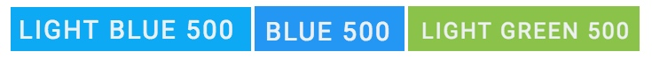
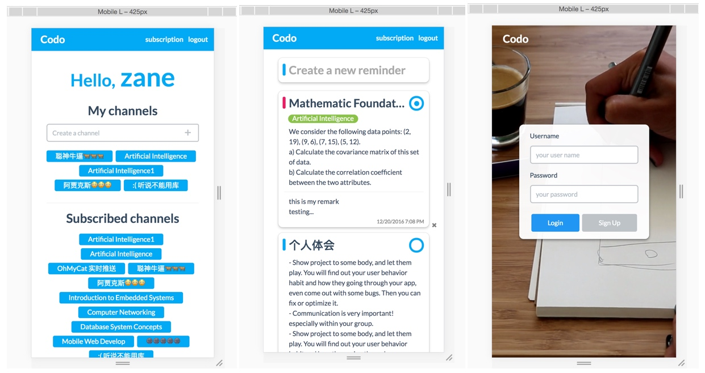

# Codo Angular2 web app 

Just a todo-list angular2 with subscription feature.
Build with Angular-cli.

> 以下只是我project期末报告的一部分

Codo的web前端采用Angular2开发，通过RESTful API与后端交互，因为这是一款工具型APP，我们采用Client side render这种方式带给用户更好的体验。

## Environment
IDE： WebStorm
Tools： Angular-cli, Chrome develop tools
Language： HTML, Css, Typescript

## 设计模式

我们采用了Client side render这种方式来提升用户体验，Client side render即在把所有的app资源下载到本地，再由javascript来bootstrap它们，相当于在自己的浏览器上面运行了一个app，接着通过RESTful API与后端进行交互。这种选型的好处在于，用户在进行操作的时候不用每一个页面都由服务器来生成，减少延迟，并且每一次请求的数据量都很小（通过JSON进行交互）。克服传统的Server side render带来的延时长的缺陷，给用户一种接近原生应用的体验。

## UI
Codo的UI设计以简约大气的风格为主

采用Material Color作为主色

### 登录界面

登录界面采用全屏的视频作为背景（HTML5新特性）， 屏幕正中心即为登录框，点击Sign up按钮即通过翻转动画转变为注册框.

当账号密码错误，账号密码为空的时候，都会显示warning.

### 主界面

首先来看一下新建Reminder的部分

当你点击输入框的时候，则会通过下拉动画展开新建Reminder的div

在整个Codo中active的输入框背景都会用一种淡淡的蓝色来标示。

左上角的小蓝点是优先级的选项，普通，中等，紧急三种属性分别用如下三个颜色来表示

当你需要设置due的时候，可以点击remind me on a day，然后就会弹出timepicker给你选时间

当你需要为你自己的channel广播消息的时候，请点击右下角的Own位置，弹出的下拉菜单中可以选择你要发广播的channel，当你的channel太多的时候，可以通过上面的输入框进行检索。

当所有输入都完成之后，只需要点击+这个按钮，就完成添加Reminder了。

再来看一下现有的Reminder

- 左上角的优先级标示跟创建Reminder的时候一致，需要修改的时候只需点击它即可。
- 标题下面的绿色部分显示来自那个Channel（会用绿色显示自己创建的channel，蓝色显示subscribe的channel，只有在带有channel的reminder中会显示出来）。
- 假如这条reminder是有属于channel的，那么它就会有Remark框。
- 右下角是due时间，如需更新同样只需点击它。
- 所有的文本输入框，需要修改Title，content，或者Remark的时候都只需点击它们即可，如果你有权限修改它们的话。
- 右下角的x是删除reminder用的，只有在鼠标在当前reminder上面的时候才会显示。
- 右上角的圆圈标示完成状态。这些都是通过CSS画出来的。 

当这条reminder完成的时候，它就会变成如下图的fade效果，此时除了state可以切换之外，其余部分均不能更新更改。

 
 ### Subscription界面
 

这个页面用以显示你创建的channel，subscribe的channel，以及可以用于创建channel，和subscribe新的channel

需要创建新的channel的时候只需在输入框中填入新channel的名字，按+按钮或者回车即可创建。

想要subscribe新的channel的时候请点击subscribe more，此时会弹出新的一个浮动窗口

Channel的块都有三个状态，如下图，从上到下风别是普通，hover，subscribe三种，想要subscribe新的channel的时候只需要点击它们就行了。

如果你需要unsubscribe一些channel，只需要在你已经subscribed的channels那里点击你要unsubscribe的就行了

----------

整个Codo的UI设计都做了自适应，适用于所有平台所有设备所有屏幕尺寸.

## UX
> UX是最能体现匠心的部分

- Codo使用尽量少但又不单调的动画来使用户体验到活力。
- 在新建新的Reminder的时候，先将Reminder加进list里面，而不是等服务器完成请求之后再添加。假如服务器错误，则把数据重新放回在创建Reminder的窗口上，并告知用户发生错误。这样可以大幅度提升用户的体验。
- 适配各个尺寸的屏幕，以及适配各种不同内核的browser
- 不同页面采用的是懒加载，不需要的资源不会加载。

